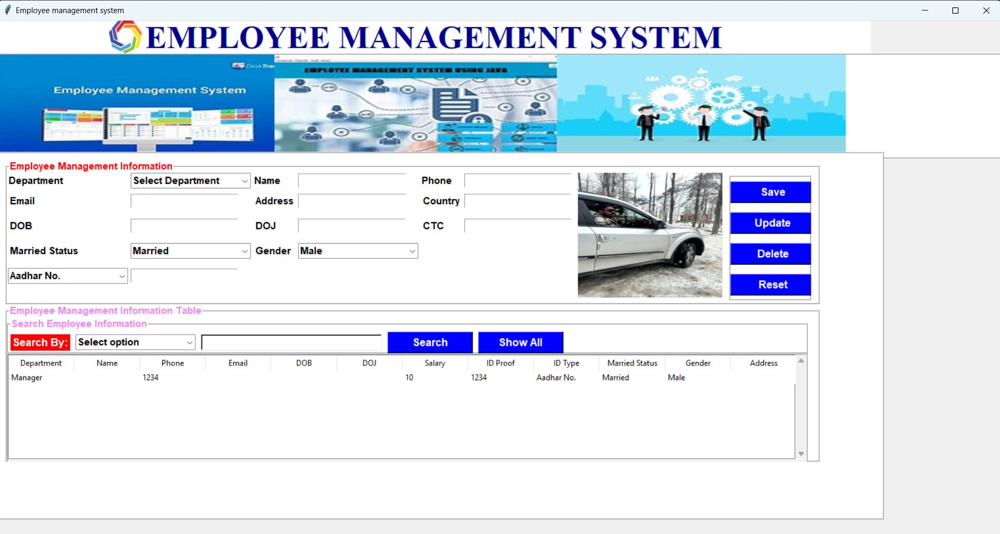

**EMPLOYEE MANAGEMENT SYSTEM**

**PREREQISITE:**
   
    Python
    MySQL

 Features:

    Pull or download the zip file of the project.
    Set image path according to your system.

    On Command Prompt or Terminal Run Following cOmmands:

    pip install mysql-connector-python
    pip install ttk
    pip install pillow

  Tech:
    
    Employee management system uses a number of open source projects to work properly:

[Python] - For easy learning and fast running!
[Tkinter] - awesome GUI creator
[MySQL] - For managing database
And of course Employee management system itself is open source with a [public repository][dill] on GitHub

Development
Great experience!  It gives a lot of skills to learn while making an project.

Make a change in your file and instantaneously see your updates!

